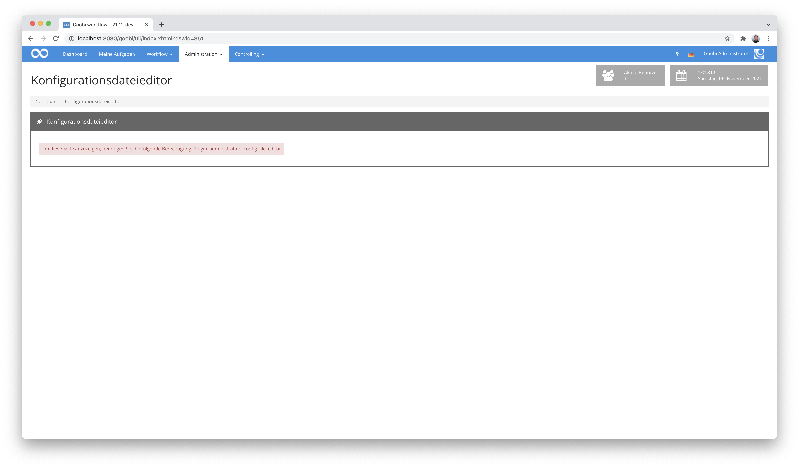
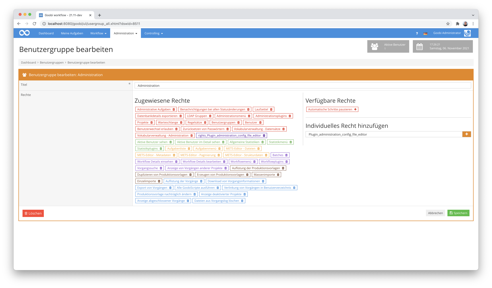
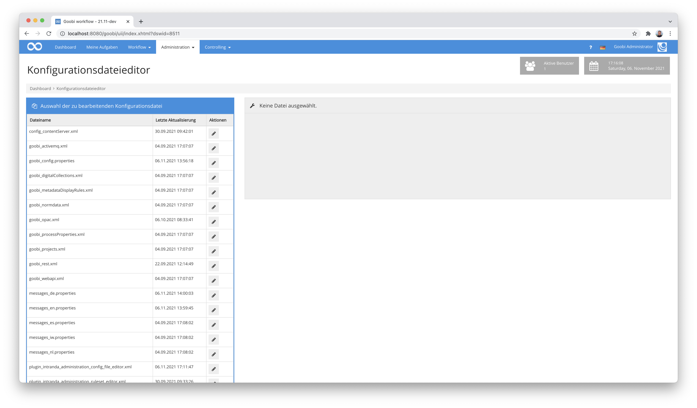
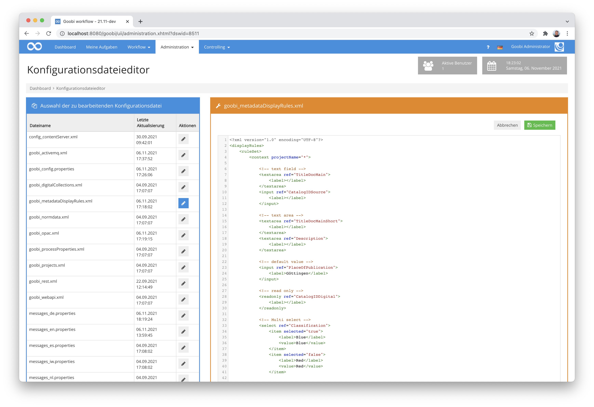
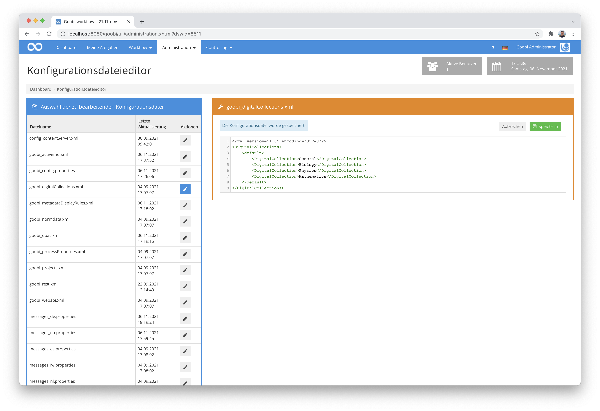
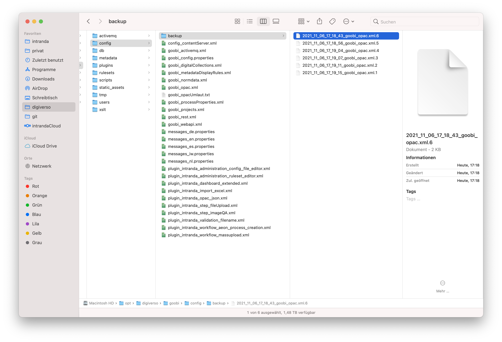
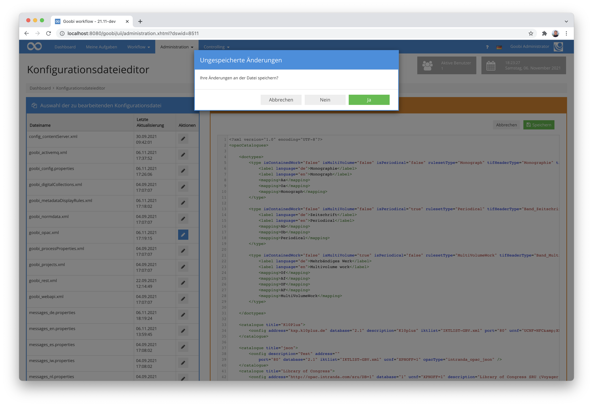
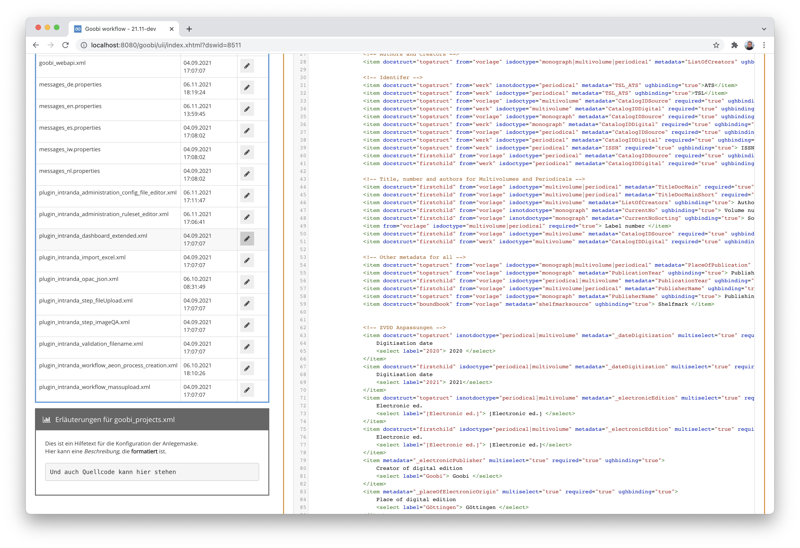

## Einführung
Dieses Plugin dient zur direkten Bearbeitung der verschiedenen Konfigurationsdateien von Goobi workflow direkt aus der Benutzeroberfläche innerhalb des Webbrowsers.


## Installation
Das Plugin besteht insgesamt aus den folgenden zu installierenden Dateien:

```bash
plugin_intranda_administration_config_file_editor_base-base.jar
plugin_intranda_administration_config_file_editor_gui-base.jar
plugin_intranda_administration_config_file_editor.xml
```

Diese Dateien müssen in den richtigen Verzeichnissen installiert werden, so dass diese nach der Installation unter den folgenden Pfaden vorliegen:

```bash
/opt/digiverso/goobi/plugins/administration/plugin_intranda_administration_config_file_editor-base.jar
/opt/digiverso/goobi/plugins/GUI/plugin_intranda_administration_config_file_editor-gui.jar
/opt/digiverso/goobi/config/plugin_intranda_administration_config_file_editor.xml
```
Dieses Plugin verfügt über eine eigene Berechtigungsstufe für die Verwendung. Aus diesem Grund müssen Nutzer über die erforderlichen Rechte verfügen.



Bitte weisen Sie daher der Benutzergruppe der entsprechenden Nutzer das folgende Recht zu:

```
Plugin_administration_config_file_editor
```




## Überblick und Funktionsweise
Nach der Installation ist das Plugin in einem eigenen Eintrag im Menü `Administration` zu finden, von wo es geöffnet werden kann.



Nach dem Öffnen werden auf der linken Seite alle Konfigurationsdateien von Goobi aufgelistet. Diese kann man durch Anklicken des jeweiligen Icons öffnen, um sie zu bearbeiten.

Bitte beachten Sie, dass die Konfigurationsdatei dieses Plugins aus Sicherheitsgründen standardmäßig nicht in der Liste erscheint und nur für Superadministratoren bearbeitbar ist.

Es werden außerdem keine versteckten Dateien und keine Dateien aus versteckten Ordnern angezeigt.



Öffnet man eine Datei, erscheint auf der rechten Seite ein Texteditor, in dem die Datei bearbeitet werden kann. Bearbeitet und speichert man eine Datei, wird im definierten Backupverzeichnis automatisch ein Backup angelegt.



Entsprechend des eingestellten Wertes in der Konfigurationsdatei bleibt hier eine gewisse Anzahl an älteren Backups erhalten, bevor diese durch neuere ersetzt werden.



Wurde eine Datei verändert und wird ohne zuvor zu speichern ein Wechsel zu einer anderen Datei versucht, bekommt der Bearbeiter eine Rückfrage, wie mit den Änderungen zu verfahren ist.



Innerhalb von Goobi können für Konfigurationsdateien Hilfetexte definiert werden, die für die Bearbeitung in diesem Editor behilflich sein können. Die hinterlegten Hilfetexte werden dabei abhängig von der derzeit geöffneten Datei im linken Bereich angezeigt und verfügen auch über die Möglichkeit, dass hier mit Formatierungen gearbeitet wird.




## Konfiguration
Die Konfiguration des Plugins erfolgt über die Konfigurationsdatei `plugin_intranda_administration_config_file_editor.xml` und kann im laufenden Betrieb angepasst werden. Im folgenden ist eine beispielhafte Konfigurationsdatei aufgeführt:

{{CONFIG_CONTENT}}

Die Parameter innerhalb dieser Konfigurationsdatei haben folgende Bedeutungen:

Parameter           |  Erläuterung
------------------- | -----------------------------------------------------
`configFileDirectories`       | Dies ist die Liste, die alle ausgewählten Konfigurationsdateipfade beinhaltet. Der in Goobi Workflow voreingestellte Konfigurationsdateipfad wird immer verwendet.
`directory`                   | Konfigurationsdateien aus dem hier angegebenen absoluten Pfad werden in der Benutzeroberfläche angezeigt. Der Pfad wird ignoriert, wenn er nicht existiert.
`backupFolder`                | Dieser Parameter gibt einen relativen Pfad in `directory` an, in dem die Backup-Dateien gespeichert werden sollen. Standardmäßig wird `backup/` verwendet, wenn der Parameter nicht angegeben wird. Um Backupdateien im selben Verzeichnis wie `directory` speichern zu lassen, überschreiben Sie den Wert mit `backupFolder=""`.
`backupFiles`                 | Dieser ganzzahlige Wert gibt an, wie viele Backup-Dateien pro Konfigurationsdatei gespeichert bleiben, bevor sie durch neue Backups überschrieben werden. Der Standardwert beträgt 8.
`fileRegex`                   | Dieser Parameter ermöglicht eine Filterung der angezeigten Konfigurationsdateien in dem entsprechenden Ordner. Es kann ein beliebiger Regex-Ausdruck eingetragen werden. Wird dieser Parameter nicht verwendet oder ein leerer Text angegeben, so werden alle Dateien angezeigt.

Sollen Hilfetexte zu einzelnen Konfigurationsdateien angezeigt werden, so müssen diese innerhalb der messages-Dateien hinterlegt werden. Hierzu wird beispielsweise in diesen Dateien eine Anpassung vorgenommen:

```bash
/opt/digiverso/goobi/config/messages_de.properties
/opt/digiverso/goobi/config/messages_en.properties
```

Für jede Konfigurationsdatei kann dort in der jeweiligen Datei ein Wert wie die folgenden eingetragen werden.

Deutsche Fassung innerhalb der Datei `messages_de.properties`:

```properties
plugin_administration_config_file_editor_help_goobi_projects.xml = Dies ist ein Hilfetext für die Konfiguration der Anlegemaske. <br/>Hier kann eine <i>Beschreibung</i>, die <b>formatiert</b> ist.<br/><br/><pre>Und auch Quellcode kann hier stehen</pre>
```

Englische Fassung innerhalb der Datei `messages_en.properties`:

```properties
plugin_administration_config_file_editor_help_goobi_projects.xml = This is a help text for the creation mask. <br/>You can add a <i>Description</i> here, which is <b>formatted</b>.<br/><br/><pre>And you can put source code here as well</pre>
```

Zu beachten ist hierbei, dass jeweils der Präfix `plugin_administration_config_file_editor_help_` vor dem Namen der Konfigurationsdatei angefügt wird.
